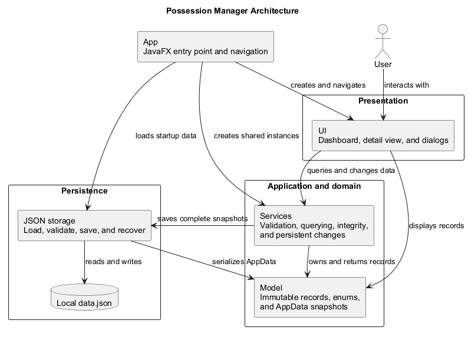

# Possession Manager Developer Guide

## Table of Contents

- [1. Introduction](#1-introduction)
- [2. Setting Up](#2-setting-up)
- [3. Architecture](#3-architecture)
- [4. Design](#4-design)
- [5. Implementation](#5-implementation)
- [6. Design Considerations](#6-design-considerations)
- [7. Testing](#7-testing)
- [8. Instructions for Manual Testing](#8-instructions-for-manual-testing)
- [9. Acknowledgements](#9-acknowledgements)

## 1. Introduction

### Purpose

This guide explains how Possession Manager is structured, implemented, tested, and maintained. It
complements the [User Guide](UserGuide.md), which describes the application from an end user's
perspective.

### Intended audience

This guide is intended for developers who need to build, test, understand, maintain, or extend the
application. Readers are expected to be familiar with Java, Gradle, and basic object-oriented
design. Familiarity with JavaFX and JUnit is useful but not required.

### Product scope

Possession Manager is a local JavaFX desktop application for recording physical possessions and
their lifecycle histories. A user can add, edit, view, search, filter, and permanently delete
possessions. Each possession can have dated lifecycle events that can also be added, edited, and
deleted.

The application stores its data in a JSON file under the current user's home directory. It does
not use accounts, cloud synchronization, or external services. The design therefore focuses on a
single local user, referential integrity between possessions and lifecycle events, and recovery
from local storage failures.

## 2. Setting Up

### Prerequisites

- Java Development Kit (JDK) 25
- Git
- An internet connection for the first build, when Gradle downloads the required distribution and
  dependencies
- An IDE with Java and Gradle support, or a terminal

Confirm that Java 25 is active:

```bash
java --version
```

The first output line should report version 25. A separate Gradle installation is not required
because the repository includes the Gradle 9.7.1 wrapper.

### Importing and running the project

1. Clone the repository and enter its root directory:

   ```bash
   git clone https://github.com/haowern98/CS3227-2610-MP1.git
   cd CS3227-2610-MP1
   ```

2. When using an IDE, open the repository root as a Gradle project, select JDK 25 for the project
   and Gradle JVM, and allow the Gradle synchronization to finish.
3. Run the application using the Gradle wrapper.

   Windows:

   ```powershell
   .\gradlew.bat run
   ```

   macOS or Linux:

   ```bash
   ./gradlew run
   ```

The application entry point is `com.possessionmanager.App`. A window titled
`Possession Manager` should open on the dashboard.

### Running automated tests

Run the JUnit test suite from the repository root.

Windows:

```powershell
.\gradlew.bat test
```

macOS or Linux:

```bash
./gradlew test
```

The HTML test report is generated at `build/reports/tests/test/index.html`.

Before integrating a change, run the same full verification performed by the build jobs in GitHub
Actions:

Windows:

```powershell
.\gradlew.bat clean check javadoc assemble
```

macOS or Linux:

```bash
./gradlew clean check javadoc assemble
```

## 3. Architecture

Possession Manager uses a small layered architecture. `App` initializes the application and keeps
the shared service and storage instances used across screen changes. JavaFX views handle user
interaction, services own application state and domain rules, model records represent that state,
and the storage component persists complete `AppData` snapshots to a local JSON file.



The arrows show the major dependencies between the components. The architecture is kept within one
desktop process; the JSON file is the only external data boundary.

### Component responsibilities

| Component | Role |
| --- | --- |
| [Application](#application-startup) | Starts the app and controls navigation |
| [UI](#ui-component) | Displays data, collects input, and reports errors |
| [Service](#service-component) | Manages state, validation, integrity, and persistence |
| [Model](#model-component) | Defines immutable application data |
| [Storage](#storage-component) | Loads and safely saves local JSON data |

### Application startup

At startup, `App` obtains the platform-independent data path from `AppDataFile` and asks
`JsonStorage` to load it. The returned `AppData` initializes `PossessionService`, after which
`LifecycleEventService` is initialized with the same possession service and the saved events. This
shared reference allows lifecycle operations to verify that every event belongs to an existing
possession.

`App` then creates one JavaFX scene, applies the shared stylesheet, and displays the dashboard.
Navigation replaces the scene root instead of creating a new window or recreating the services, so
both main views operate on the same in-memory state.

If loading fails, `App` reports the storage error and continues with an empty `AppData` snapshot.
Corrupt-file preservation is handled inside `JsonStorage` and is explained in
[Startup and corrupt-data recovery](#startup-and-corrupt-data-recovery).

## 4. Design

### UI component

### Model component

### Service component

### Storage component

## 5. Implementation

### Possession querying

### Lifecycle-event integrity and cascade deletion

### Persistent changes and rollback

### Startup and corrupt-data recovery

## 6. Design Considerations

### Local JSON persistence

### Immutable domain records and stable identifiers

### Restoring service contents during rollback

## 7. Testing

### Automated testing

### GUI testing

### Cross-platform continuous integration

## 8. Instructions for Manual Testing

### Test environment and launch

### Managing possessions

### Searching and filtering

### Managing lifecycle events

### Recovering from a save failure

### Recovering from invalid data

## 9. Acknowledgements

### Libraries and tools

### Reused or inspired material

### AI assistance
