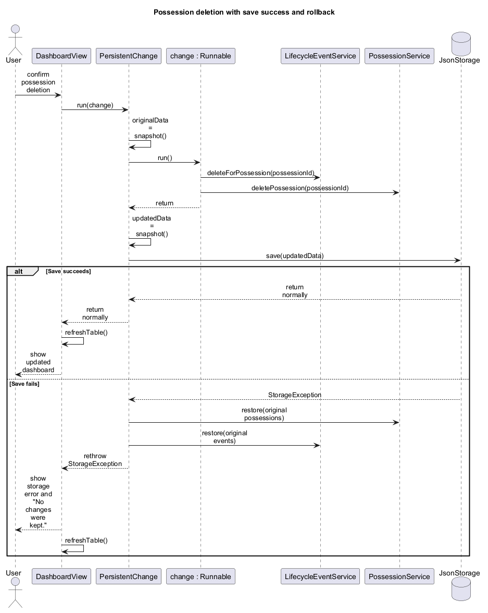

# Possession Manager Developer Guide

## Table of Contents

- [1. Introduction](#1-introduction)
- [2. Setting Up](#2-setting-up)
- [3. Architecture](#3-architecture)
- [4. Design](#4-design)
- [5. Implementation](#5-implementation)
- [6. Design Considerations](#6-design-considerations)
- [7. Testing](#7-testing)
- [8. Instructions for Manual Testing](#8-instructions-for-manual-testing)
- [9. Acknowledgements](#9-acknowledgements)

## 1. Introduction

### Purpose

This guide explains how Possession Manager is structured, implemented, tested, and maintained. It
complements the [User Guide](UserGuide.md), which describes the application from an end user's
perspective.

### Intended audience

This guide is intended for developers who need to build, test, understand, maintain, or extend the
application. Readers are expected to be familiar with Java, Gradle, and basic object-oriented
design. Familiarity with JavaFX and JUnit is useful but not required.

### Product scope

Possession Manager is a local JavaFX desktop application for recording physical possessions and
their lifecycle histories. A user can add, edit, view, search, filter, and permanently delete
possessions. Each possession can have dated lifecycle events that can also be added, edited, and
deleted.

The application stores its data in a JSON file under the current user's home directory. It does
not use accounts, cloud synchronization, or external services. The design therefore focuses on a
single local user, referential integrity between possessions and lifecycle events, and recovery
from local storage failures.

## 2. Setting Up

### Prerequisites

- Java Development Kit (JDK) 25
- Git
- An internet connection for the first build, when Gradle downloads the required distribution and
  dependencies
- An IDE with Java and Gradle support, or a terminal

Confirm that Java 25 is active:

```bash
java --version
```

The first output line should report version 25. A separate Gradle installation is not required
because the repository includes the Gradle 9.7.1 wrapper.

### Importing and running the project

1. Clone the repository and enter its root directory:

   ```bash
   git clone https://github.com/haowern98/CS3227-2610-MP1.git
   cd CS3227-2610-MP1
   ```

2. When using an IDE, open the repository root as a Gradle project, select JDK 25 for the project
   and Gradle JVM, and allow the Gradle synchronization to finish.
3. Run the application using the Gradle wrapper.

   Windows:

   ```powershell
   .\gradlew.bat run
   ```

   macOS or Linux:

   ```bash
   ./gradlew run
   ```

The application entry point is `com.possessionmanager.App`. A window titled
`Possession Manager` should open on the dashboard.

### Running automated tests

Run the JUnit test suite from the repository root.

Windows:

```powershell
.\gradlew.bat test
```

macOS or Linux:

```bash
./gradlew test
```

The HTML test report is generated at `build/reports/tests/test/index.html`.

Before integrating a change, run the same full verification performed by the build jobs in GitHub
Actions:

Windows:

```powershell
.\gradlew.bat clean check javadoc assemble
```

macOS or Linux:

```bash
./gradlew clean check javadoc assemble
```

### Repository layout

```text
CS3227-2610-MP1/
├── src/
│   ├── main/java/com/possessionmanager/
│   │   ├── model/       immutable records, inputs, enums, AppData
│   │   ├── service/     application logic and persistence coordination
│   │   ├── storage/     JSON loading and saving
│   │   ├── ui/          JavaFX views and dialogs
│   │   └── App.java     application entry point
│   └── test/java/com/possessionmanager/
│       ├── service/     service and rollback tests
│       └── storage/     JSON storage tests
├── docs/                guides and UML diagrams
├── test/                manual UI test plan
├── .github/workflows/   continuous-integration workflow
├── logs/                verified AI interaction summaries
├── build.gradle         build configuration
└── gradlew(.bat)        Gradle wrapper scripts
```

## 3. Architecture

Possession Manager uses a small layered architecture. `App` initializes the application and keeps
the shared service and storage instances used across screen changes. JavaFX views handle user
interaction, services own application state and domain rules, model records represent that state,
and the storage component persists complete `AppData` snapshots to a local JSON file.


The arrows show the major dependencies between the components. The architecture is kept within one
desktop process; the JSON file is the only external data boundary.

### Component responsibilities

| Component | Role |
| --- | --- |
| [Application](#application-startup) | Starts the app and controls navigation |
| [UI](#ui-component) | Displays data, collects input, and reports errors |
| [Service](#service-component) | Manages state, validation, integrity, and persistence |
| [Model](#model-component) | Defines immutable application data |
| [Storage](#storage-component) | Loads and safely saves local JSON data |

### Application startup

At startup, `App` loads an `AppData` snapshot through `JsonStorage`, initializes the shared
services, and displays the dashboard. Navigation reuses the same service and storage instances,
ensuring that all views operate on one consistent in-memory state.

## 4. Design

### UI component

The UI is built programmatically with JavaFX. `App` owns one `Scene` and switches its root between
`DashboardView` and `PossessionDetailView`, while retaining the same services and storage. This
keeps navigation separate from application state.

`PossessionDialog` and `LifecycleEventDialog` return input records only when the user confirms the
dialog. They do not modify application state directly. The views pass those records to services,
refresh their observable table data after each attempted change, and present validation or storage
errors at the UI boundary.

### Model component

The model uses Java records for `Possession`, `LifecycleEvent`, their input types, and `AppData`.
Stored records have stable UUIDs and creation timestamps. Updates create replacement records while
preserving the identifier and original creation time.

The records prevent callers from changing owned collections: `Possession` defensively copies its
tags, and `AppData` copies both lists. A `LifecycleEvent` stores the UUID of its owning possession
rather than a mutable object reference.

### Service component

`PossessionService` owns possessions and provides validation, normalization, CRUD operations, and
combined dashboard queries. `LifecycleEventService` owns lifecycle events and holds a reference to
the possession service so that it can reject events whose possession does not exist.

Both services keep mutable maps private and return immutable list snapshots. `PersistentChange`
forms the persistence boundary around mutations: it snapshots both services, runs one change,
saves the updated snapshot, and restores both services if the change or save fails.

### Storage component

`AppDataFile` resolves the data file below the current user's home directory. `JsonStorage` uses
Gson to serialize one complete `AppData` snapshot, including adapters for `LocalDate` and
`LocalDateTime`.

Before saving or accepting loaded JSON, storage reconstructs the services to validate duplicate
IDs and event ownership. A save writes to a temporary file before replacing `data.json`; it requests
an atomic move and falls back to a normal replacement when the file system does not support one.

## 5. Implementation

### Possession querying

`PossessionService.query(...)` applies the dashboard criteria in one stream. The search text is
trimmed and compared case-insensitively against possession names and tags. Category and status are
optional predicates, represented by `null` when the corresponding filter is not selected. Results
are always sorted by name without case sensitivity.

Keeping the combined query in the service gives the dashboard one source of truth for search and
filter semantics. The UI only supplies the current control values and displays the returned list.

### Lifecycle-event integrity and cascade deletion

Every lifecycle operation that receives a possession ID verifies it through `PossessionService`.
This prevents new or loaded events from referring to a missing possession. Events are returned
newest first for display.

When a possession is deleted, `DashboardView` first deletes its lifecycle events and then deletes
the possession. This order is required because `deleteForPossession(...)` verifies that the owner
still exists. Both operations run inside one `PersistentChange`, so a failure restores the
possession and all of its events together.

### Persistent changes and rollback

`PersistentChange.run(...)` captures one `AppData` snapshot before invoking the supplied mutation.
It then saves a second snapshot containing the updated possessions and lifecycle events. If either
the mutation or save throws a runtime exception, it restores the contents of both existing service
objects and rethrows the same exception.



The sequence diagram uses possession deletion because it changes both collections. On a storage
failure, the services are restored before `StorageException` reaches the dashboard. The dashboard
shows the storage error and refreshes its table in `finally`, so the restored state is displayed.
Validation failures follow the same rollback path but retain their validation message.

### Startup and corrupt-data recovery

If `data.json` does not exist, `JsonStorage.load()` returns an empty `AppData`. For an existing file,
it deserializes the JSON and validates the resulting snapshot through the services.

If reading, parsing, or validation fails, storage attempts to move the file beside the original as
`data.corrupt-<timestamp>.json` and throws `StorageException`. `App` reports the error and starts
with empty data instead of continuing with a partially valid state.

## 6. Design Considerations

### Local JSON persistence

The application uses one local JSON file because it targets one user and a modest personal data
set. Whole-snapshot persistence keeps the format and recovery process simple and works without a
database server or network connection. The trade-off is that it does not support concurrent users,
large datasets, or cloud synchronization.

### Immutable domain records and stable identifiers

Immutable records prevent views from changing service-owned state accidentally. UUIDs allow events
to retain a stable link to a possession even when possession details are replaced during an edit.
This design creates new record instances for updates, but that cost is negligible for the intended
data size and makes state changes easier to reason about.

### Restoring service contents during rollback

Rollback restores the contents of the existing services instead of replacing the service objects.
This preserves the references held by JavaFX views and by `LifecycleEventService`. A full snapshot
is copied for every change, which uses more memory than an operation-specific undo action, but it
keeps all supported mutations consistent and is appropriate for a small local dataset.

## 7. Testing

### Automated testing

The project uses JUnit 5 and temporary directories for storage tests. The current suite contains 29
tests:

| Test class | Main coverage |
| --- | --- |
| `PossessionServiceTest` | Validation, normalization, CRUD, search, and combined filters |
| `LifecycleEventServiceTest` | Ownership, dates, ordering, CRUD, and cascade support |
| `PersistentChangeTest` | Rollback for every mutation type and later-save isolation |
| `JsonStorageTest` | JSON round trips, missing files, compatibility, and corrupt-file preservation |
| `PossessionStatusTest` | Supported user-facing statuses |
| `ApplicationResourceTest` | Availability of the JavaFX stylesheet |

Run the full suite with the commands in [Running automated tests](#running-automated-tests).

### GUI testing

JavaFX interaction is tested manually because the project does not include a GUI automation
framework. The maintained [UI test plan](../test/ui-test-plan.md) covers launch, possession and
lifecycle-event workflows, navigation, date selection, persistence, cascade deletion, and save
failure recovery. Each case records its platform and observed result; pending checks remain marked
as pending rather than being reported as verified.

### Cross-platform continuous integration

GitHub Actions runs on every push and pull request, with manual dispatch also available. The build
matrix executes `clean check javadoc assemble` using Java 25 on Windows, Ubuntu, and macOS. A
separate documentation job checks required files, Markdown formatting, and unresolved merge
markers. CI verifies compilation and non-GUI tests across all three platforms; it does not replace
manual visual testing on those platforms.

## 8. Instructions for Manual Testing

### Test environment and launch

Use expendable data or back up `~/.possession-manager/data.json` before recovery tests. Record the
operating system, JDK version, command, actual result, and any screenshot used as evidence.

1. Run the application using the command in [Importing and running the project](#importing-and-running-the-project).
2. Confirm that the dashboard opens without an error.
3. Close and relaunch the application after saved-data tests to confirm persistence.

### Managing possessions

1. Add a possession with a name, category, location, status, tags, and notes.
2. Confirm that it appears alphabetically on the dashboard and remains after relaunch.
3. Edit its details and confirm that its lifecycle history remains accessible.
4. Cancel an edit and confirm that no values change.
5. Delete a possession with lifecycle events, verify the count in the confirmation, and confirm
   that unrelated possessions and events remain.

### Searching and filtering

1. Add possessions with different names, tags, categories, and statuses.
2. Search using different letter cases and a partial name or tag.
3. Combine the search with category and status filters.
4. Confirm that only matching possessions are shown and that **Clear Filters** restores the full
   alphabetically sorted list.

### Managing lifecycle events

1. Open a possession and add two lifecycle events with different dates.
2. Confirm that the newer event appears first.
3. Edit one event, then cancel a separate edit and confirm that only the saved edit is retained.
4. Attempt to save a future-dated event and confirm that a validation error is shown.
5. Delete one event and confirm that the possession and its other events remain after relaunch.

### Recovering from a save failure

On Windows, an exclusive file lock can reproduce a deterministic save failure. Start the
application with existing data, then run this in a second PowerShell window:

```powershell
$dataLock = [IO.File]::Open(
    "$env:USERPROFILE\.possession-manager\data.json",
    'OpenOrCreate', 'ReadWrite', 'None')
```

1. Attempt an addition, edit, event change, and possession deletion while the lock is held.
2. Confirm that each attempt reports `No changes were kept.` and that the displayed state is
   unchanged.
3. Release the lock with `$dataLock.Dispose()`.
4. Make one successful change, relaunch the application, and confirm that the successful change—but
   none of the failed changes—was persisted.

### Recovering from invalid data

1. Close the application and back up the current data file.
2. Replace the contents of `data.json` with invalid JSON such as `not valid JSON`.
3. Relaunch the application.
4. Confirm that an error is shown, the application starts with empty data, and a file named
   `data.corrupt-<timestamp>.json` exists in the same directory.
5. Close the application and restore the original backup after the test.

## 9. Acknowledgements

### Libraries and tools

- JavaFX provides the desktop user interface.
- Gson provides JSON serialization and deserialization.
- JUnit 5 provides automated testing.
- Gradle provides the build and dependency-management workflow.
- PlantUML is used to maintain the UML diagram sources.
- GitHub Actions and markdownlint provide continuous integration and documentation checks.

### Reused or inspired material

The documentation structure and software-engineering terminology were informed by the
[CS2103 adapted Software Engineering textbook](https://nus-cs2103-ay2627-s1.github.io/website/se-book-adapted/).
No code, diagrams, or documentation were copied from another student project.

### AI assistance

I used OpenAI Codex to review source code, draft and revise documentation, generate PlantUML
diagrams, and suggest verification steps. I inspected the generated material against the source and
remain responsible for the content and quality of the submitted work.
