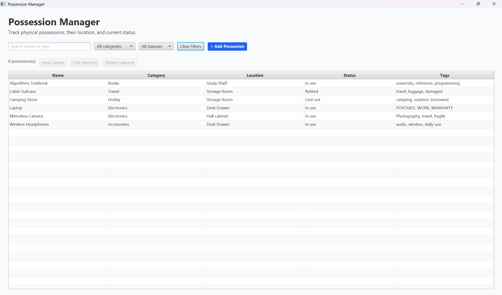
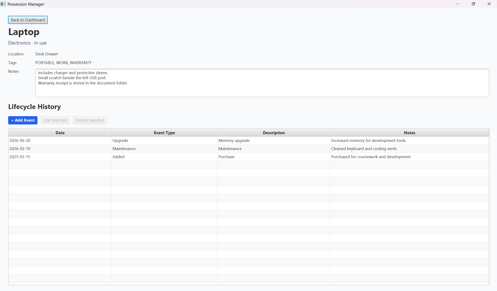
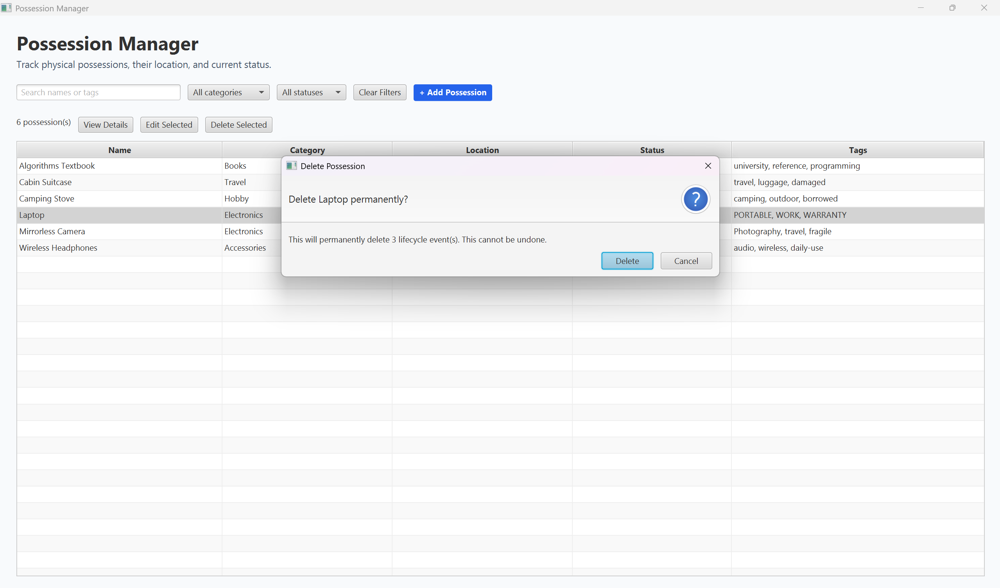

# Possession Manager User Guide

## Table of Contents

- [Overview](#overview)
- [1. Getting Started](#1-getting-started)
- [2. Using the Dashboard](#2-using-the-dashboard)
- [3. Managing Possessions](#3-managing-possessions)
- [4. Managing Lifecycle Events](#4-managing-lifecycle-events)
- [5. Data Storage and Recovery](#5-data-storage-and-recovery)
- [6. Known Limitations](#6-known-limitations)

## Overview

Possession Manager is a local desktop application for recording physical belongings, where they
are kept, their current status, and important events throughout their lifecycle. It is suitable for
items such as electronics, books, travel equipment, and hobby supplies.

The application allows you to:

- record, update, search, filter, and delete possessions;
- view the full details of a possession;
- maintain a dated lifecycle history for each possession; and
- keep data between sessions without using an online account.

## 1. Getting Started

### Requirements

- A Java 25 JDK. Run `java --version` and confirm that the first line reports version 25.
- An internet connection for the first Gradle run so that the required dependencies can be
  downloaded.
- A checkout of this repository.

### Launching the application

Open a terminal in the repository root and run the command for your operating system.

Windows:

```powershell
.\gradlew.bat run
```

macOS or Linux:

```bash
./gradlew run
```

The application opens on the dashboard. Closing the application window exits the program. Every
successful change is saved when it is made, so there is no separate save button.

### Checking that the application works

After launching the application:

1. Select **Add Possession**.
2. Enter a name, such as `Laptop`.
3. Select **OK**.
4. Confirm that the new possession appears on the dashboard.

You can delete this example later by following [Delete a possession](#delete-a-possession).

## 2. Using the Dashboard

The dashboard is the main screen for finding possessions and opening possession actions.



The dashboard contains:

1. A search box for finding possessions by name or tag.
2. Category and status filters for narrowing the displayed possessions.
3. **Clear Filters**, which restores the complete list.
4. **Add Possession**, which opens the form for recording a new item.
5. A table showing each possession's name, category, location, status, and tags.
6. Buttons for viewing, editing, or deleting the selected possession.

Possessions are displayed alphabetically by name. The count above the table shows the number of
possessions currently displayed. Select a table row to enable the possession-action buttons.

### Searching for possessions

Enter text in the search box. The results update as you type.

Search is case-insensitive and matches partial text in possession names and tags. For example,
searching for `port` can find an item named `Portable Stove` or an item tagged `portable`. Search
does not inspect locations, notes, or lifecycle events.

### Filtering possessions

Choose a category, a status, or both. Search and filters work together, so you can, for example,
search for `travel` while displaying only possessions in the **Electronics** category with the
**In use** status.

Select **Clear Filters** to clear the search text and both filters.

## 3. Managing Possessions

### Add a possession

Select **Add Possession**, complete the form, and select **OK**.

| Field | Requirement and behavior |
| --- | --- |
| Name | Required. Leading and trailing spaces are removed. |
| Category | Defaults to **Other**. Available values are Electronics, Accessories, Hobby, Books, Travel, and Other. |
| Location | Optional free text describing where the item is kept. |
| Status | Defaults to **In use**. Available values are In use, Lent out, and Retired. |
| Tags | Optional comma-separated search labels, for example `travel, fragile, warranty`. |
| Notes | Optional multiline details, such as condition, included accessories, or storage reminders. |

Empty tags and extra spaces around comma-separated tags are ignored. Tags retain the
capitalization entered by the user.

Select **Cancel** or close the dialog to leave the possessions unchanged.

### Edit a possession

1. Select a possession on the dashboard.
2. Select **Edit Selected**.
3. Change the required fields.
4. Select **OK**.

Editing a possession does not remove its lifecycle history. Select **Cancel** or close the dialog
to keep the existing details.

### View possession details

Select a possession and choose **View Details**, or double-click its table row. The detail screen
shows its category, status, location, tags, notes, and complete lifecycle history.



Blank location, tags, or notes values are displayed as `Not recorded`. Select
**Back to Dashboard** to return to the main table.

### Delete a possession

1. Select a possession on the dashboard.
2. Select **Delete Selected**.
3. Review the confirmation, including the number of lifecycle events that will also be deleted.



Select **Cancel** to keep the possession. Select **Delete** to permanently remove the possession
and all of its lifecycle events. This operation cannot be undone.

## 4. Managing Lifecycle Events

Lifecycle events record important events in a possession's history. Open the possession's detail
screen to add, edit, or delete them.

### Add a lifecycle event

Select **Add Event**, complete the form, and select **OK**.

| Field | Requirement and behavior |
| --- | --- |
| Event Type | Defaults to **Added**. Available values are Purchase, Added, Maintenance, Repair, Loan, Return, Upgrade, Retired, and Other. |
| Date | Defaults to today. Select today or an earlier date using the displayed date or calendar button. Typing and pasting are disabled. |
| Description | Required short explanation of the event. |
| Notes | Optional additional details. |

Future event dates are rejected. Events are displayed from newest date to oldest date.

Select **Cancel** or close the dialog to leave the lifecycle history unchanged.

### Edit a lifecycle event

1. Select an event from the lifecycle-history table.
2. Select **Edit Selected**.
3. Change the required fields.
4. Select **OK**.

Select **Cancel** or close the dialog to keep the existing event.

### Delete a lifecycle event

1. Select an event from the lifecycle-history table.
2. Select **Delete Selected**.
3. Confirm the deletion.

Deleting a lifecycle event removes only that event. Cancelling the confirmation keeps it.

## 5. Data Storage and Recovery

Possession Manager stores all possessions and lifecycle events in one local JSON file:

- Windows: `%USERPROFILE%\.possession-manager\data.json`
- macOS and Linux: `~/.possession-manager/data.json`

The application saves after every successful addition, edit, or deletion. Do not edit the data
file while the application is running.

### Save failure

If a change cannot be saved, the application displays an error ending with
`No changes were kept.` The attempted change is discarded, and the displayed possessions and
lifecycle events return to their state before the operation. A later successful save will not
include the failed change.

### Unreadable or invalid data

If the application cannot load an existing data file, it attempts to preserve the file beside the
original as `data.corrupt-<timestamp>.json`. It then reports the problem and starts with empty data.
The backup can be retained for investigation or manual recovery.

## 6. Known Limitations

- Data is stored locally for one operating-system user. The application does not provide cloud
  synchronization, accounts, import, or export.
- Categories, statuses, and lifecycle-event types are limited to the fixed values listed in this
  guide.
- Permanent deletion cannot be undone.
- Data that uses the `Archived` status from an earlier development version is not migrated.
- The graphical interface has been manually verified on Windows 11. Automated builds and tests
  pass on Windows, Linux, and macOS, but manual interface verification on Linux and macOS remains
  outstanding.
